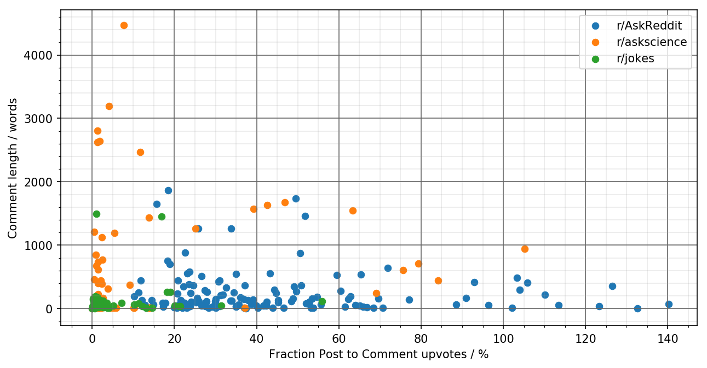

## Correlation between the length of reddit comments and their upvotes
Short Python program to illustrate the correlation between the length of reddit comments and their upvotes.
The comments are retrieved by using [the reddit api](https://www.reddit.com/dev/api/) with help of the [pushshift api](https://pushshift.io/).



### Usage
See this short example on how to use this script.

```python
import redditComments as rc

# which subreddit
subreddit = 'AskReddit'
# how many thread to investigate
amountOfThreads = 10
# Which time interval in days (here last 180 days)
timeInterval = 180
# Minimum amount of upvotes a thread must have in order to be considered
minUpvotes = 50000

r1 = redditComments(subreddit, amountOfThreads, timeInterval, minUpvotes)

# Print results in a nice way
print(r1)

# arrays of upvotes and commentLength in ascending order.
print(r1.upvotes)
print(r1.commentLength)
```
